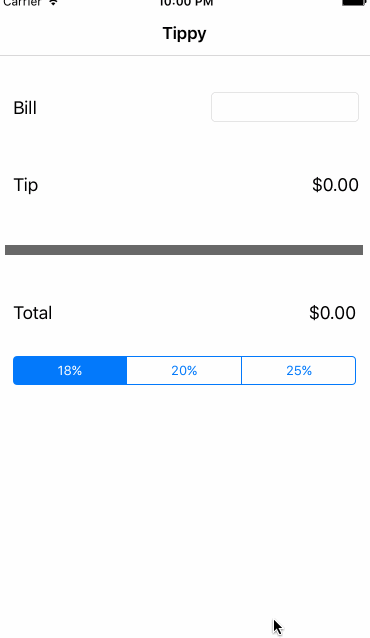

# Pre-work - *Tippy*

**Tippy** is a tip calculator application for iOS.

Submitted by: **Kathrine Becker**

Time spent: **5** hours spent in total

## User Stories

The following **required** functionality is complete:
* [x] User can enter a bill amount, choose a tip percentage, and see the tip and total values.

The following **optional** features are implemented:
* [ ] Custom font
* [ ] UI animations
* [ ] Making sure the keyboard is always visible and the bill amount is always the first responder. This way the user doesn't have to tap anywhere to use this app. Just launch the app and start typing.

The following **additional** features are implemented:

- [ ] List anything else that you can get done to improve the app functionality!

## Video Walkthrough 

Here's a walkthrough of implemented user stories:

GIF created with [LiceCap](http://www.cockos.com/licecap/).

## Notes

Describe any challenges encountered while building the app.
- Simulator view would not correctly display app configured for iPhone 5s; had to adjust to 6s
- Instructions unclear about how to add a readme file. One set indicates that the readme should be created right after finishing creating the app in xcode, implying that the readme is made in xcode. Spent a lot of time trying to figure out how to do that, eventually decided to skip it and just upload the file to github... and then realized that the readme is created IN github.

## License

    Copyright [2016] [Kathrine Becker]

    Licensed under the Apache License, Version 2.0 (the "License");
    you may not use this file except in compliance with the License.
    You may obtain a copy of the License at

        http://www.apache.org/licenses/LICENSE-2.0

    Unless required by applicable law or agreed to in writing, software
    distributed under the License is distributed on an "AS IS" BASIS,
    WITHOUT WARRANTIES OR CONDITIONS OF ANY KIND, either express or implied.
    See the License for the specific language governing permissions and
    limitations under the License.
